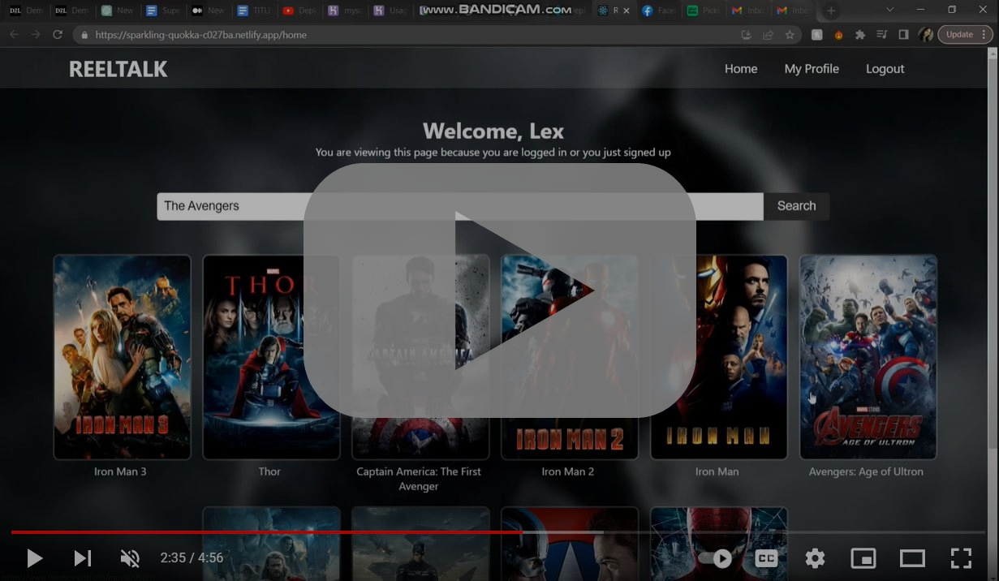
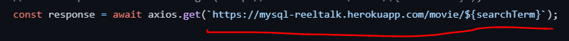
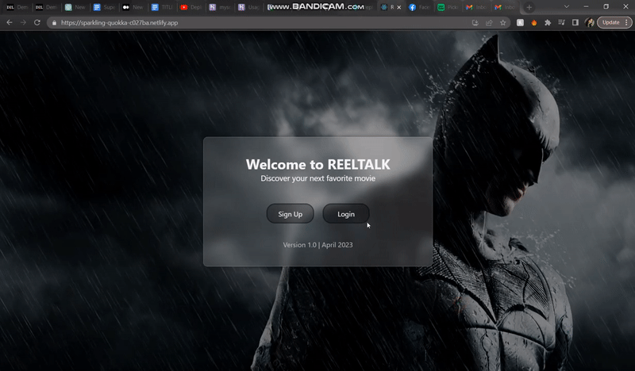
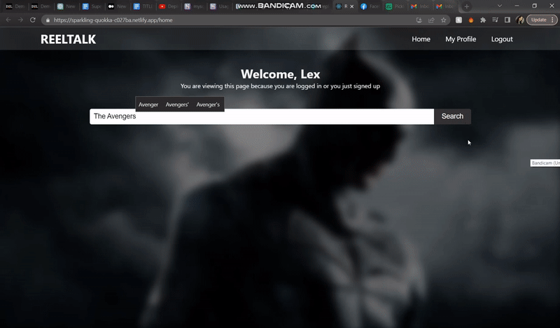
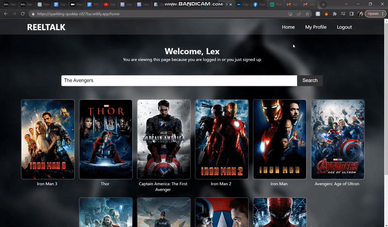

<!-- PROJECT LOGO -->
 

<h3 align="center">REELTALK - Full-Stack CRUD Movie Recommendations Website</h3>

  

    An interactive website application built in React, Express, and MySQL that uses
	the TMBDI API to recommend movies to the user based on a movie that they
	provide. Using OAuth 2.0, users can sign-in using Google sign-in.
     
     
     
  

<!-- TABLE OF CONTENTS -->

  
Table of Contents

  <ol>
    <li>
      <a href="#about-the-project">About The Project</a>
      <ul>
        <li><a href="#built-with">Built With</a></li>
      </ul>
    </li>
    <li>
      <a href="#getting-started">Getting Started</a>
    </li>
    <li><a href="#usage">Usage</a></li>
    <li><a href="#contact">Contact</a></li>
    <li><a href="#acknowledgments">Acknowledgments</a></li>
  </ol>

<!-- ABOUT THE PROJECT -->
## About The Project

 

This project is full-stack CRUB website application with the front-end built using React, React Router, the back-end built using
Express, and the database being MySQL. It uses OAuth 2.0 to verifiy and signup and signin users using Google, and
store the user information into the database. When the user is logged in, they can type a movie of choice into the
search bar and have a list of 10 movies that are recommended to them based on that movie. They can also edit their 
profile from the profile tab.

(<a href="#readme-top">back to top</a>)

### Built With

* [![My-SQL][MySQL]][MySQL-url]
* 
* 
* 
* 

(<a href="#readme-top">back to top</a>)

<!-- GETTING STARTED -->
## Getting Started
### Client side setup
To get started, you must have MySQL Workbench installed (or any other of your choice). The dependencies needed to run Node.js
projects including React and Express. 
  
To get the client side of the program to function properly with your environment, you'll need to change the URL in the api calls
along with the the google ID's. The <code>REACT_APP_GOOGLE_CLIENT_ID</code> needs to be changed with your own that you can get from <a href="https://developers.google.com/identity/oauth2/web/guides/get-google-api-clientid">Google here</a>. Replace REACT_APP_GOOGLE_CLIENT_ID in the <code>env.local</code> file which can be found in the root directory of this repo.

 
Under <b>src</b> folder you will need to go into the <b>Home.jsx</b>, <b>Login.jsx</b>,
<b>Profile.jsx</b>, and <b>Signup.jsx</b> and change the URL for the API calls, to either your hosted domain, or localhost if hosted 
locally. Below is an example of the URL you would need to change. Only change the url <b>BEFORE</b> the routes, i.e. <b>/movie/${searchTerm}</b>.
 

### Server side setup
Now that the client side is done being setup, the server side now needs to be modified. From this point going forward, each file I mention is inside the server side. You can view the server side in my other <a href="https://github.com/bburton0334/reeltalk_server">repo here</a>. The cors origin URL (which is the URL of the client side) will need to be modified in <code>app.js</code> file found in the root directory. If running locally, change the <code>port</code> variable value to your port of choice.
  

In the root directory 2 values inside the <code>.env</code> file need to be changed to your values, the <code>GOOGLE_CLIENT_ID</code> and the <code>JWT_SECRET</code>. Next, inside the <code>routes/login.js</code>, <code>routes/update.js</code>, and <code>routes/signup.js</code>, the host, user, password, and database values will need to be changed to your MySQL database in the <code>pool</code> variable. Finally, you will need to get an API key for TMDB. <a href="https://developers.themoviedb.org/3/getting-started/introduction">You can get one here</a>. After you get your api key, replace the <code>API_KEY</code> in <code>routes/movie.js</code>.

  

<b>IMPORTANT NOTE:</b> This program will not work unless you supply <b>ALL</b> of your own URLs, IDs, database info, keys, ect.

 
 

<!-- USAGE EXAMPLES -->
## Usage

Once both the client and server are either running locally or are deployed, you can now fully use the REELTALK web application. A video demo and brief breakdown of the program <a href="https://www.youtube.com/watch?v=gEh8yMlWHxg" target="_blank">can be viewed here</a>, or by clicking the image at the very top of this readme.  

 

Example of logging into the website using OAuth 2.0 with Google signin.

 

Example of searching a movie title and being shown 10 recommend movies that can be clicked.

 

Example of visiting the users profile page and having the name, email, photo, and editable bio being shown.

(<a href="#readme-top">back to top</a>)

<!-- CONTACT -->
## Contact

Briana R. E. Burton - [in/briana-burton/](https://www.linkedin.com/in/briana-burton/) - brianareburton@gmail.com

Project Link: [https://github.com/bburton0334/reeltalk_client](https://github.com/bburton0334/reeltalk_client)

(<a href="#readme-top">back to top</a>)

<!-- ACKNOWLEDGMENTS -->
## Acknowledgments

* I am not responsible for someone maliciously copying this source code with the intent of submitting it as their own for an assignment.

(<a href="#readme-top">back to top</a>)

<!-- MARKDOWN LINKS & IMAGES -->
[.Net]: https://img.shields.io/badge/.NET-5C2D91?style=for-the-badge&logo=.net&logoColor=white
[.Net-url]: https://learn.microsoft.com/en-us/dotnet/desktop/winforms/overview/?view=netdesktop-7.0
[MySQL]: https://img.shields.io/badge/mysql-%2300f.svg?style=for-the-badge&logo=mysql&logoColor=white
[MySQL-url]: https://www.mysql.com/
[WPF]: https://img.shields.io/badge/wpf-000000?style=for-the-badge&logo=xaml&logoColor=white
[WPF-url]: https://visualstudio.microsoft.com/vs/features/wpf/
[C-sharp]: https://img.shields.io/badge/C%23-000000?style=for-the-badge&logo=csharp&logoColor=white
[Csharp-url]: https://docs.microsoft.com/en-us/dotnet/csharp/
[Azure]: https://img.shields.io/badge/azure-000000?style=for-the-badge&logo=microsoftazure&logoColor=white
[Azure-url]: https://azure.microsoft.com/en-us/
[Service]: https://img.shields.io/badge/windows%20service-000000?style=for-the-badge&logo=windows&logoColor=white
[Service-url]: https://docs.microsoft.com/en-us/dotnet/framework/windows-services/introduction-to-windows-service-applications
